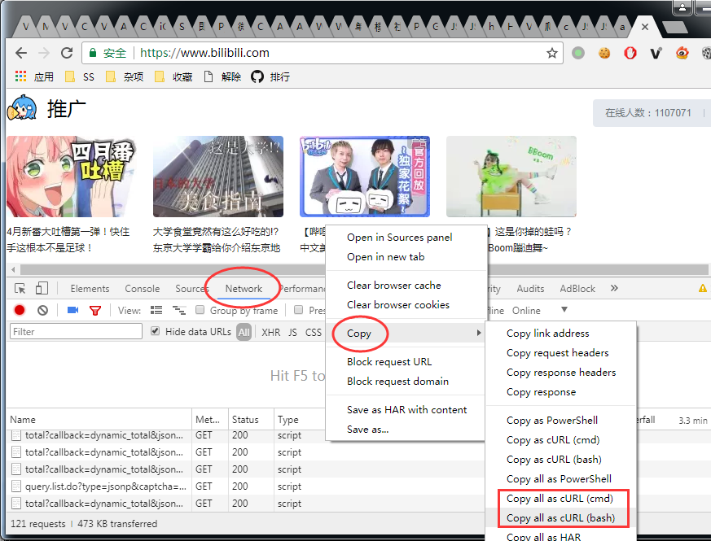
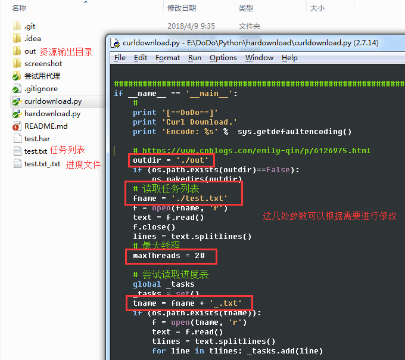

## 网站资源下载脚本 ##

使用方法:

### 1. 在 chrome 开发者面板切换到 Network 页签 ###

### 2. 右键 -> Copy -> Copy all as cURL(cmd) 或者 Copy all as cURL(bash) 都可以 ###

### 3. 粘贴到脚本目录里的 test.txt 文件中 ###

### 4. 如果有 test.txt_.txt 文件请删除 这是工程进度文件 ###

### 5. 运行脚本 会自动在 out 目录保存下载的资源 ###

